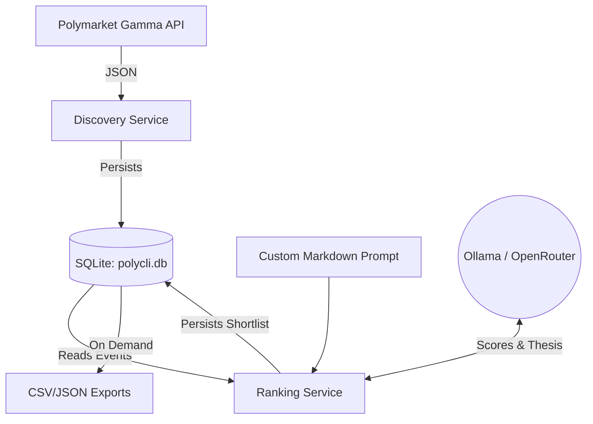

<div align="center">

```text
    ____       _        ____ _     ___ 
   |  _ \ ___ | |_   _  / ___| |   |_ _|
   | |_) / _ \| | | | | | |   | |    | | 
   |  __/ (_) | | |_| | | |___| |___ | | 
   |_|   \___/|_|\__, | \____|_____|___|
                 |___/  
```

**Investigative observatory for Polymarket. Discover, rank with LLMs, simulate, and stream live markets.**

[](https://github.com/bobbinetor/polycli/actions/workflows/ci.yml)
[](https://pypi.org/project/polycli/)
[](https://www.python.org/downloads/)
[](https://opensource.org/licenses/MIT)

</div>

## What is PolyCLI?

PolyCLI is a terminal-based intelligence tool for Polymarket. It allows researchers to continuously scan the prediction market ecosystem, rank markets for risk or opportunity using local AI (Ollama) or cloud models (OpenRouter), and simulate trading strategies via paper trading.

### PolyCLI vs Official Polymarket CLI

The [official Polymarket CLI](https://github.com/Polymarket/polymarket-cli) is a Rust-based trading terminal. It requires your private key, manages wallets, and places real on-chain orders.

**PolyCLI is the research layer.** It is an investigative companion tool. You do not need a wallet or private key to use PolyCLI. You use PolyCLI to discover, rank, and monitor markets, and then you use the official CLI (or the web UI) to execute your trades.

| Feature | Official `polymarket-cli` | PolyCLI |
|---|---|---|
| **Purpose** | Trading Terminal | Investigative Observatory |
| **Authentication** | Private Key | None (Uses Public APIs) |
| **Trading** | Real On-chain Orders | Paper Trading (Simulation) |
| **Market Discovery** | Basic Search | Advanced Keyword + Watchlist Scans |
| **AI Integration** | None | Local/Cloud LLM Ranking |
| **Data Storage** | Live Queries Only | Persistent SQLite Snapshots |

---

## Features

- 🕵️ **Market Discovery**: Bulk search the Gamma API across multiple keywords and labels.
- 🧠 **LLM Risk Ranking**: Pipe snapshots through Ollama or OpenRouter to find anomalies, wash-trading risks, or edge cases based on custom prompts.
- 📉 **Paper Trading**: Simulate entering and closing positions at live prices without risk.
- 📡 **Live Streaming**: Connect to the Polymarket WebSocket to watch order book changes in real time.
- ⏰ **Watchlists**: Schedule background discovery jobs that poll at set intervals.
- 💻 **Claude-style REPL**: A highly responsive, interactive terminal loop with auto-complete and bottom-bar syntax hinting.

---

## Quick Start

### Installation

The recommended way to install PolyCLI is using `pipx` or `uv`:

```bash
# Using pipx
pipx install polycli

# Using uv
uv tool install polycli
```

### Usage

Simply run `polycli` to drop into the interactive REPL:

```bash
polycli
```

Once inside the REPL, try:
```text
/discover bitcoin solana limit=50
/rank provider=ollama
/data
```

For scripting or CI, you can also run single commands directly:
```bash
polycli discover bitcoin --limit 10
polycli rank cli --provider ollama
```

---

## Command Reference

Inside the REPL, type `/help` to see all commands, or type `--help` after any command for detailed usage.

| Command | Description |
|---|---|
| `/discover <kw...>` | Run a keyword discovery against the API. |
| `/rank` | Rank the latest snapshot with an LLM. |
| `/watch <subcommand>` | Manage recurring watchlists (`list`, `add`, `edit`). |
| `/job <subcommand>` | Run scheduled jobs. |
| `/paper <subcommand>` | Manage paper-trading positions (`enter`, `close`, `positions`). |
| `/stream <subcommand>`| Control the live websocket stream. |
| `/data` | View past snapshots. |
| `/export` | Export SQLite data to CSV or JSON. |

---

## Architecture

PolyCLI runs on a unified SQLite storage backend. We don't spam your filesystem with CSVs.



## Configuration

PolyCLI looks for an `.env` file in your working directory. You can also set these as environment variables. See `.env.example` for all options.

```env
# OpenRouter (if using cloud ranking)
POLYMARKET_OPENROUTER_API_KEY="sk-or-v1-..."
POLYMARKET_OPENROUTER_MODEL="anthropic/claude-3-haiku"

# Ollama (if using local ranking)
POLYMARKET_OLLAMA_MODEL="gemma4-e4b-abliterated-Q8:latest"
```

## Custom Prompts

PolyCLI uses a markdown file to instruct the LLM on how to rank events. The default example is located in `config/prompts/prompt-example.md`.

You can create your own prompt files to look for specific patterns (e.g., political arbitrage, wash trading) and point PolyCLI to it via the `.env` file (`POLYMARKET_DEFAULT_PROMPT_PATH`).

---

## 🤖 MCP Server (Model Context Protocol)

PolyCLI natively ships with an **MCP Server**, allowing AI assistants (like Claude Desktop or Cursor) to use PolyCLI as a tool to query Polymarket and rank events directly in your chat!

### Claude Desktop Configuration

Edit your Claude Desktop config file:
- **macOS:** `~/Library/Application Support/Claude/claude_desktop_config.json`
- **Windows:** `%APPDATA%\Claude\claude_desktop_config.json`

Add the `polycli` server:

```json
{
  "mcpServers": {
    "polycli": {
      "command": "uv",
      "args": [
        "tool",
        "run",
        "polycli-mcp"
      ]
    }
  }
}
```

Once configured, you can ask Claude: 
*"Use PolyCLI to discover the latest markets about 'AI', rank them for me, and then investigate the top holders of the riskiest market to see what else they are trading."*

### Available MCP Tools

PolyCLI provides a comprehensive suite of tools for both market discovery and forensic wallet investigation.

#### Discovery & Ranking
- `discover_markets(keywords, limit, label)`: Search Polymarket for events.
- `list_snapshots(label)`: List historical snapshots.
- `get_snapshot_events(run_id)`: Retrieve raw market data.
- `rank_snapshot(run_id, provider, dry_run, max_rows)`: Run the ranking engine on a snapshot.

#### Forensic Investigation
- `profile_wallet(address)`: Look up public profile info (pseudonym, bio, X/Twitter).
- `get_wallet_positions(address)`: See all current open positions for a wallet.
- `get_wallet_trades(address)`: Get the full trade history to detect suspicious patterns.
- `get_wallet_portfolio_value(address)`: Quickly assess whale vs. retail.
- `get_market_top_holders(condition_id)`: See who controls a specific market.
- `get_price_history(clob_token_id)`: Analyze historical price movements and volume spikes.

---

## Development

See [CONTRIBUTING.md](CONTRIBUTING.md) for instructions on setting up the local development environment, running tests, and contributing to PolyCLI.

## License

MIT License. See [LICENSE](LICENSE) for details.
